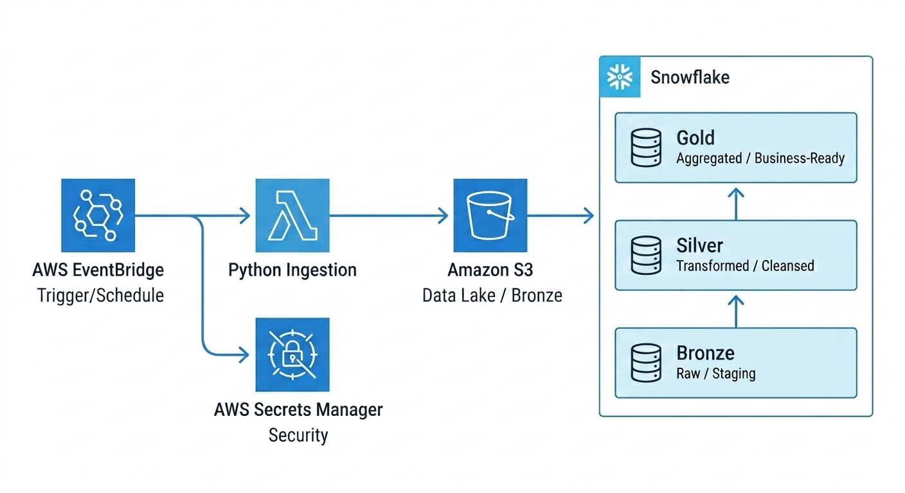

# Snowflake-S3-Lambda-EventBridge: End-to-End Currency ETL Pipeline

This project implements a robust, automated, and serverless Data Engineering pipeline that fetches real-time currency exchange rates, stores them in a Data Lake, and processes them into a Snowflake Data Warehouse using the Medallion Architecture.



## 🚀 Architecture Overview
The pipeline follows a modern cloud data stack pattern:
1.  **Orchestration:** **AWS EventBridge** triggers the process on a scheduled hourly basis.
2.  **Ingestion:** **AWS Lambda** (Python) fetches data from the Open Exchange Rates API.
3.  **Security:** **AWS Secrets Manager** securely stores and retrieves API keys and Snowflake credentials.
4.  **Data Lake (Bronze):** Raw JSON response is archived in **Amazon S3** with a partitioned folder structure (`YYYY/MM/DD`).
5.  **Data Warehouse (Silver/Gold):** **Snowflake** receives the raw data. A **Stored Procedure** then flattens the JSON and merges it into final analytical tables.

## 🛠️ Tech Stack
*   **Language:** Python 3.11
*   **Cloud:** AWS (Lambda, S3, EventBridge, Secrets Manager, IAM)
*   **Data Warehouse:** Snowflake
*   **Database Objects:** SQL Stored Procedures, Streams/Tasks (optional), Medallion Modeling

## 🏗️ Data Modeling (Medallion Architecture)
Within Snowflake, data flows through three distinct layers:
*   **Bronze (`EXCHANGE_RATES_RAW`):** Stores the raw, immutable JSON payload along with ingestion timestamps.
*   **Silver (`EXCHANGE_RATES_STG`):** A transient staging layer where data is flattened using `LATERAL FLATTEN`.
*   **Gold (`EXCHANGE_RATES`):** The final production table. Uses `MERGE` logic to ensure **Idempotency** (no duplicate records for the same timestamp).

## 🔧 Key Features
*   **Secure Credential Handling:** Zero hardcoded passwords; fully integrated with AWS Secrets Manager.
*   **Scalable & Serverless:** Entirely event-driven architecture that scales with data volume.
*   **Automated Schema-on-Read:** Handles semi-structured JSON data efficiently using Snowflake’s `VARIANT` type.
*   **Error Logging:** Integrated with AWS CloudWatch for real-time monitoring and debugging.

## 📂 Project Structure
```text
├── lambda_function.py       # Main Lambda handler logic
├── snowflake_provider.py    # Custom class for Snowflake & AWS Secrets connectivity
├── snowflake.sql            # DDLs and Stored Procedure logic
└── README.md                # Project documentation
```

## 📖 How to Run
1.  **AWS Setup:** Create an S3 bucket and a Secret in AWS Secrets Manager containing your Snowflake credentials.
2.  **Snowflake Setup:** Execute the DDLs in `snowflake_2.sql` to create the database, schema, and stored procedure.
3.  **Deploy Lambda:** Upload the Python code and attach the necessary IAM policies (S3 PutObject, SecretsManager GetSecretValue).
4.  **Trigger:** Enable the EventBridge rule to start the automated ingestion.

---

**Author:** [Muhammad Osama Hashmi (CloudDataWithOsama)](https://github.com/CloudDataWithOsama)  
**Role:** Cloud Data Engineer  
**Date:** May 2026